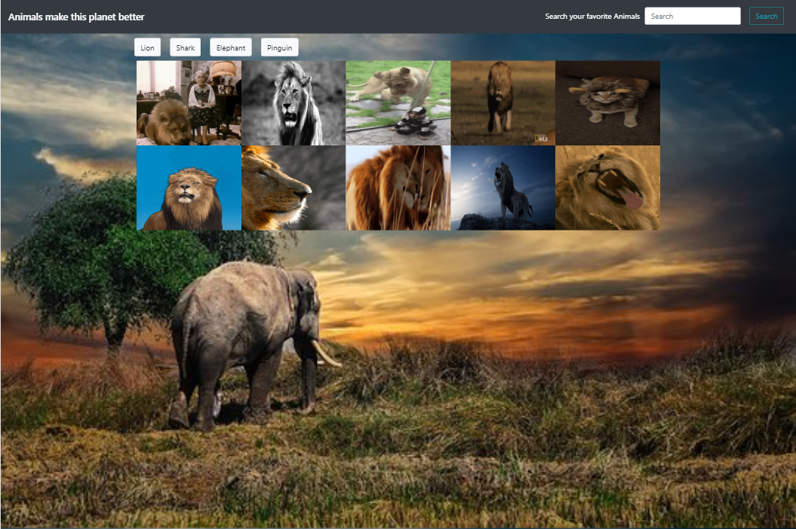

# giphy-page

This app will allow you to control the gifs by clicking on them. If the gif is paused,
it can be animated by clicking on it and viceverse.
There are four different kinds of animals to choose from that were set as a default but you can add your
own favorite animals and play with up to ten gifs that will appear on the screen every time you add them.
Once the page gets refreshed, all added animals will disappear from the page.

- To view this Page:https://mguaraz120.github.io/giphy-page/
- My Portfolio:https://mguaraz120.github.io/Portfolio/
- My Linkedin Page:https://www.linkedin.com/in/mario-vizcaino-187ab9104/

## Technologies Used

- Jquery for Dom Manipulation
- HTML
- CSS
- Javascript
  
